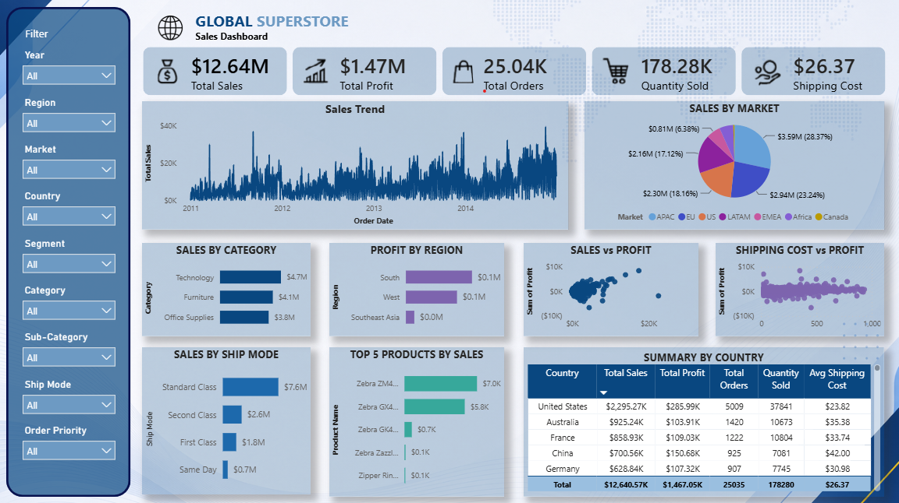

# 🌍 Global Superstore Sales Dashboard

An interactive Power BI dashboard developed to analyze Global Superstore sales performance across regions, markets, product categories, and customer segments. The dashboard provides business insights through key performance indicators (KPIs), sales trends, profitability analysis, and interactive filters to support data-driven decision-making.

---

## 📊 Dashboard Preview

> Upload your dashboard screenshot as **dashboard.png** and replace the image below.



---

## 🎯 Project Objective

This dashboard aims to provide a comprehensive overview of Global Superstore's sales performance by enabling users to monitor key business metrics, compare regional performance, identify top-performing products, and evaluate profitability across different dimensions.

---

## ✨ Key Features

- 💰 Total Sales KPI
- 📈 Total Profit KPI
- 📦 Total Orders
- 🛒 Quantity Sold
- 🚚 Average Shipping Cost
- 📅 Sales Trend Analysis
- 🌎 Sales by Market
- 🏷️ Sales by Category
- 📍 Profit by Region
- 📊 Sales vs Profit Analysis
- 🚚 Shipping Cost vs Profit Analysis
- 🚛 Sales by Ship Mode
- 🏆 Top 5 Products by Sales
- 🌍 Country Performance Summary
- 🎛️ Interactive Filters (Year, Region, Market, Country, Segment, Category, Sub-Category, Ship Mode, Order Priority)

---

## 🛠️ Tools & Technologies

- Power BI Desktop
- Power Query
- DAX
- Data Modeling
- Interactive Slicers

---

## 📈 Dashboard Highlights

- **Total Sales:** $12.64M
- **Total Profit:** $1.47M
- **Total Orders:** 25.04K
- **Quantity Sold:** 178.28K
- **Average Shipping Cost:** $26.37

---

## 📂 Repository Structure

```text
Global-Superstore-Sales-Dashboard/
│
├── superstore.pbip
├── superstore.Report/
├── superstore.SemanticModel/
├── dashboard.png
└── README.md
```

---

## 📊 Dataset

The dataset contains historical Global Superstore sales transactions, including:

- Order Date
- Region
- Market
- Country
- Category & Sub-Category
- Customer Segment
- Sales
- Profit
- Quantity
- Shipping Cost
- Ship Mode
- Order Priority

---

## 🚀 How to Use

1. Clone this repository.
2. Open the `.pbip` project in **Power BI Desktop**.
3. Refresh the dataset if required.
4. Explore the dashboard using the interactive filters.

---

## 👩‍💻 Author

**Nadia Annisa Chasiavera**

GitHub: https://github.com/NadiaAnnisaChasiavera
